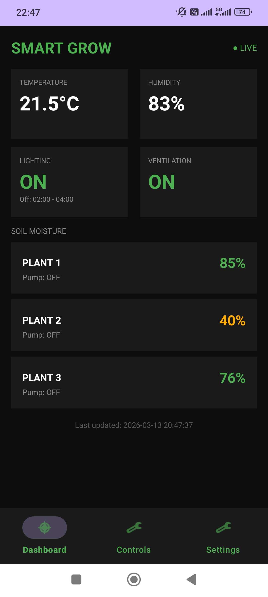
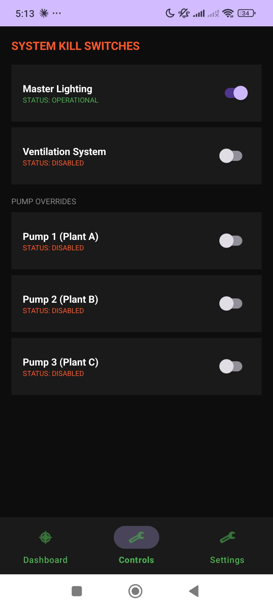
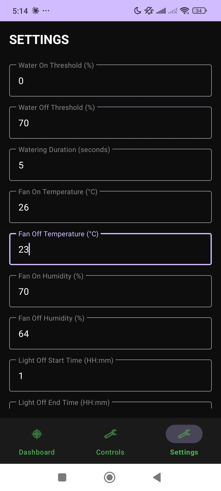

# 🌿 Smart Grow Room Automation System

A fully autonomous indoor plant monitoring and control system built from scratch — spanning embedded firmware, cloud backend, and a native Android application. Designed and developed as a solo end-to-end project.

---

## 📸 Screenshots

| Dashboard | Controls | Settings |
|:-:|:-:|:-:|
|  |  |  |
| Live sensor readings & per-plant soil moisture | System kill switches & pump overrides | Configurable thresholds for all automation logic |

---

## ✅ Project Status
- [x] ESP32 firmware (Arduino C++)
- [x] Backend REST + SQLite server (Node.js, Express)
- [x] Android app (Java, OkHttp + Gson)
- [x] Real-time states + historical data
- [x] Security with API key header
- [x] Local dev tests passed

## 🏗️ System Architecture

```
┌─────────────────────────┐
│      Android App        │  ← Java, Android Studio
│  Dashboard / Controls   │
│       / Settings        │
└────────────┬────────────┘
             │ HTTPS REST + API Key
             ▼
┌─────────────────────────┐
│   Node.js / Express     │  ← Ubuntu server, PM2
│   SQLite Database       │
│   Cloudflare Tunnel     │  ← api.example.org
└────────────┬────────────┘
             │ HTTP POST / GET
             ▼
┌─────────────────────────┐
│      ESP32-S3           │  ← C++ / Arduino framework
│  Sensors · Relays · NTP │
└─────────────────────────┘
```

---

## ✨ Features

### Firmware (ESP32-S3)
- **Soil moisture monitoring** via ADS1115 ADC (3 capacitive sensors)
- **Temperature & humidity** via DHT11
- **Automated watering** with hysteresis (35%-45% threshold per plant)
- **NTP-synced lighting** (22h on / 2h off, timezone-aware)
- **Ventilation control** (hysteresis via temperature + humidity)
- WiFi with auto-reconnect

### Backend (Node.js / Express)
- REST API (sensor data + configuration)
- SQLite persistence (readings + settings)
- PM2 managed process
- Cloudflare Tunnel support
- API key authentication

### Android App (Java)
- **Dashboard**: Real-time sensors, pump status, color-coded soil levels
- **Controls**: Kill switches + pump overrides with live indicators
- **Settings**: Full remote configuration of automation thresholds

---

## 🔧 Hardware

| Component | Role |
|---|---|
| ESP32-S3 | Main microcontroller |
| ADS1115 | 16-bit ADC for soil sensors |
| Capacitive Soil Sensors (×3) | Per-plant moisture |
| DHT11 | Temperature & humidity |
| Relay Module (×5) | Pump + light + fan control |
| Water Pumps (×3) | Automated irrigation |
| Grow Light | NTP-scheduled |
| Ventilation Fan | Hysteresis-controlled |

**Estimated cost: ~40€**

---

## 🚀 Setup Instructions

### Prerequisites
- Node.js ≥ 18
- npm
- Android Studio (for app)
- Arduino IDE (for firmware)

### Backend Setup

```bash
git clone https://github.com/orfeastops/auto-grow-system.git
cd auto-grow-system
npm install
cp .env.example .env
# Edit .env: API_KEY=your-secret, PORT=3000
npm start
```

**Production (with PM2):**
```bash
pm2 start server --name greenhouse-api
pm2 save
pm2 startup
```

**Cloudflare Tunnel (public access):**
```bash
cloudflared tunnel create greenhouse
cloudflared tunnel route dns greenhouse api.yourdomain.org
cloudflared tunnel run greenhouse
```

### Android App

```bash
# Open in Android Studio, update ApiClient.BASE_URL
# Build and install
./gradlew assembleDebug
```

### ESP32 Firmware

Upload `arduino main code.cc` via Arduino IDE to ESP32-S3.

---

## 📡 API Endpoints

| Method | Path | Auth | Description |
|---|---|---|---|
| POST | `/api/data` | API Key | ESP32 sensor upload |
| GET | `/api/data/latest` | API Key | Latest snapshot |
| GET | `/api/data/history?hours=N` | API Key | Historical data |
| GET | `/api/settings` | API Key | Read settings |
| POST | `/api/settings` | API Key | Update setting |
| GET | `/api/health` | Open | Health check |

**Example:**
```bash
curl -H 'x-api-key: secret' http://localhost:3000/api/settings
curl -X POST -H 'x-api-key: secret' -H 'Content-Type: application/json' \
  -d '{"key":"light_enabled","value":"0"}' http://localhost:3000/api/settings
```

---

## 🔐 Security

- Store `API_KEY` in `.env` (never commit)
- Use `.env.example` template with placeholders
- `greenhouse.db` excluded via `.gitignore`
- HTTPS via Cloudflare Tunnel for production
- Rotate keys periodically

---

## 📁 Repository Structure

```
.gitignore                 # Excludes .env, node_modules, *.db
.env.example               # Environment template
README.md                  # This file
package.json               # Dependencies
server                     # Express backend
arduino main code.cc       # ESP32 firmware
app/                       # Android application
html/                      # Web UI (React)
Dashboard.jpg              # Screenshots
Controls.jpg
settings.jpg
```

---

## 🧪 Testing

Local verification passed with all endpoints tested via curl.

**Smoke test:**
```bash
PORT=3001 API_KEY=test npm start &
curl -H 'x-api-key: test' http://localhost:3001/api/health
curl -H 'x-api-key: test' http://localhost:3001/api/settings
```

---

## 🔮 Roadmap

- [ ] Push notifications (moisture alerts)
- [ ] Historical charts in app
- [ ] OTA firmware updates
- [ ] Multi-room support
- [ ] OAuth2 authentication
- [ ] Docker support
- [ ] Firebase Cloud Messaging

---

## 🛠️ Tech Stack

| Layer | Technology |
|---|---|
| Microcontroller | ESP32-S3, C++ (Arduino) |
| Sensors | ADS1115, DHT11 |
| Backend | Node.js, Express, SQLite |
| Process Mgmt | PM2 |
| Tunneling | Cloudflare Tunnel |
| Mobile | Android (Java) |

---

## 👤 Author

**Orfeas** — Solo end-to-end design, build, testing.

- GitHub: [@orfeastops](https://github.com/orfeastops)
- Repo: [github.com/orfeastops/auto-grow-system](https://github.com/orfeastops/auto-grow-system)

---

## 📄 License

Open source. Adapt freely for your projects.

---
1. `cd /home/linux/Desktop/greenhouseapp/auto-grow-system`
2. `npm install`
3. `cp .env.example .env`
4. Edit `.env`:
   - `API_KEY=your-secret-key`
   - `PORT=3000`
5. `node server`

### Start with PM2 (production)
```bash
pm i -g pm2
pm2 start server --name greenhouse-api --update-env
pm2 save
```

### Cloudflare tunnel (optional for public access)
*Configure `cloudflared` as tunnel*:\
`cloudflared tunnel create greenhouse`\
`cloudflared tunnel route dns greenhouse api.example.org`\
`cloudflared tunnel run greenhouse`

**APP URL**: `https://api.example.org`

## 🔐 API key
the backend expects `x-api-key` header on /api/data,/api/settings,/api/data/* endpoints.

## 📘 Node API
| Method | Path | Auth | Description |
|---|---|---|---|
| POST | /api/data | API Key | ESP32 sends sensor state |
| GET | /api/data/latest | API Key | Latest sensor snapshot |
| GET | /api/data/history?hours=N | API Key | History (default 24h) |
| GET | /api/settings | API Key | Read settings |
| POST | /api/settings | API Key | Write setting |
| GET | /api/health | open | Health check |

## 📲 Android setup
1. Open `app/` in Android Studio.
2. Set `ApiClient.BASE_URL` to your backend host (e.g. `https://api.example.org`).
3. Make sure `API_KEY` is the same as in server `.env`.
4. Build & run.

## 💬 Support

For questions or issues, please open an issue on GitHub.
