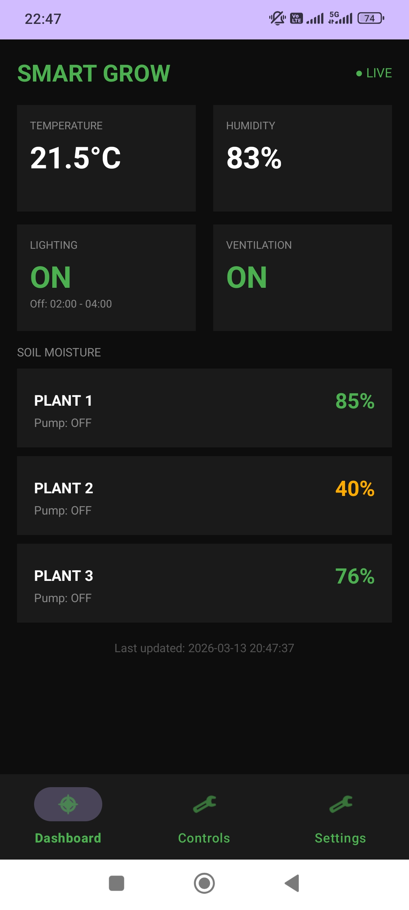
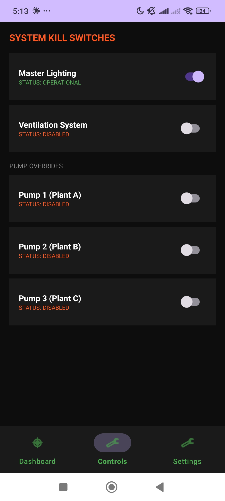
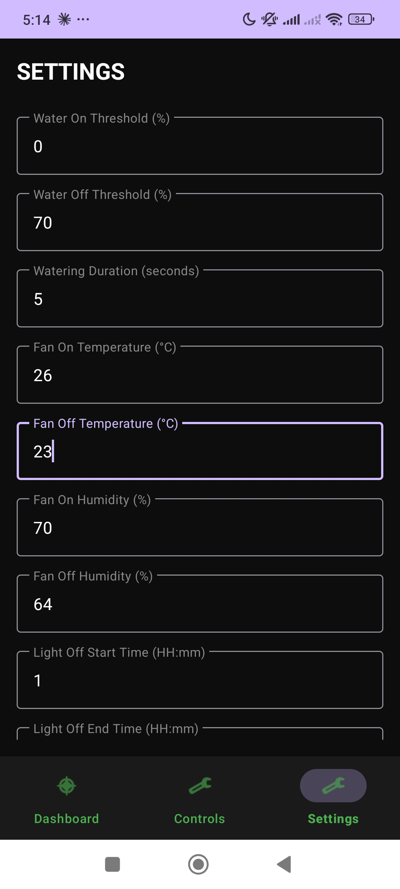
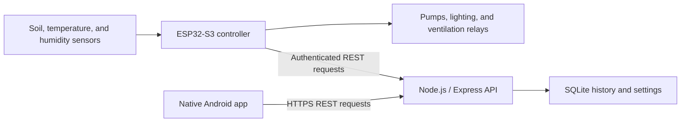

# Smart Grow Room Automation System

[](https://github.com/orfeastops/auto-grow-system/actions/workflows/ci.yml)
[](LICENSE)

An end-to-end IoT prototype that monitors an indoor grow space and automates irrigation, lighting, and ventilation. I designed and implemented the complete path from ESP32-S3 firmware to a Node.js API and native Android application.

## At a glance

- **Embedded control:** three soil-moisture channels, temperature/humidity sensing, relay outputs, hysteresis, and NTP-based schedules.
- **Backend:** Express REST API with SQLite persistence and environment-based API-key authentication.
- **Mobile client:** native Android app for live readings, manual overrides, configuration, and history.
- **Deployment:** Docker-ready backend with health checks and optional Cloudflare Tunnel access.
- **Project role:** solo architecture, implementation, integration, and prototype testing.

## Application screenshots

| Live dashboard | Manual controls | Configuration |
|:-:|:-:|:-:|
|  |  |  |

## System architecture


```mermaid
flowchart LR
    A["Soil, temperature, and humidity sensors"] --> B["ESP32-S3 controller"]
    B --> C["Pumps, lighting, and ventilation relays"]
    B -->|"Authenticated REST requests"| D["Node.js / Express API"]
    D --> E["SQLite history and settings"]
    F["Native Android app"] -->|"HTTPS REST requests"| D
```

The controller performs the time-critical automation locally. The backend stores measurements and configuration, while the Android client provides remote visibility and control. This separation allows local automation to continue when the mobile application is not connected.

## What I implemented

### ESP32-S3 firmware

- Three capacitive soil-moisture inputs through an ADS1115 ADC.
- DHT11 temperature and humidity acquisition.
- Per-channel irrigation thresholds with hysteresis.
- Scheduled grow-light control synchronized through NTP.
- Temperature/humidity-based ventilation logic.
- Wi-Fi reconnection and periodic telemetry uploads.

### Node.js backend

- REST endpoints for measurements, history, configuration, and health status.
- SQLite tables for time-series readings and persistent automation settings.
- API-key middleware configured through environment variables.
- Docker image, Compose configuration, and container health checks.

### Android application

- Live sensor and actuator dashboard.
- Manual pump, fan, and light overrides.
- Remote threshold configuration.
- Local persistence for historical readings.

## Technology stack

| Layer | Technology |
|---|---|
| Controller | ESP32-S3, C++/Arduino |
| Sensors | ADS1115, capacitive soil sensors, DHT11 |
| Backend | Node.js, Express, SQLite |
| Mobile | Android, Java, OkHttp, Gson, Room |
| Deployment | Docker, Docker Compose, optional Cloudflare Tunnel |

## Repository structure

- `arduino main code.cc` — ESP32-S3 prototype firmware.
- `server` — Express/SQLite backend entry point.
- `app/` — native Android application.
- `Dockerfile`, `docker-compose.yml` — backend containerization.
- `.env.example` — required local configuration template.
- `Dashboard.jpg`, `Controls.jpg`, `settings.jpg` — application screenshots.

## Running the backend

### Local Node.js

```bash
git clone https://github.com/orfeastops/auto-grow-system.git
cd auto-grow-system
cp .env.example .env
# Replace the placeholder in .env with a strong API key.
npm install
npm start
```

### Docker Compose

Create `.env` first; startup intentionally fails if `API_KEY` is missing.

```bash
cp .env.example .env
# Edit .env, then:
docker compose up -d --build
docker compose logs -f greenhouse-api
```

The API is exposed locally on port `3000` by default.

## API overview

| Method | Path | Purpose |
|---|---|---|
| `POST` | `/api/data` | Upload a sensor/actuator snapshot |
| `GET` | `/api/data/latest` | Read the latest snapshot |
| `GET` | `/api/data/history?hours=N` | Read historical measurements |
| `GET` | `/api/settings` | Read automation settings |
| `POST` | `/api/settings` | Update an automation setting |
| `GET` | `/api/health` | Container/service health check |

All routes except the health check require the `x-api-key` header.

## Android configuration

Keep endpoint and API-key values outside the Java source. Add them to your local, untracked `~/.gradle/gradle.properties` file:

```properties
API_BASE_URL=https://api.example.org
API_KEY=replace-with-the-same-strong-api-key
```

The build exposes these local values through generated `BuildConfig` fields. Repository defaults are non-functional placeholders.

## Validation and limitations

- The integrated prototype was exercised locally with real sensors, relay outputs, and manual API smoke tests.
- The repository includes basic build/syntax checks; broader automated integration and hardware-in-the-loop testing remain future work.
- API-key authentication is appropriate for this prototype but would be replaced with per-device credentials and stronger authorization for a multi-user production deployment.
- Relay isolation, electrical protection, watchdog behavior, and failure-safe states must be reviewed before unattended operation.

## Roadmap

- Historical charts and configurable alert notifications.
- OTA firmware updates.
- Multi-room/device support.
- Hardware-in-the-loop tests and structured observability.
- Per-device authentication and key rotation.

## License

Released under the [MIT License](LICENSE).
